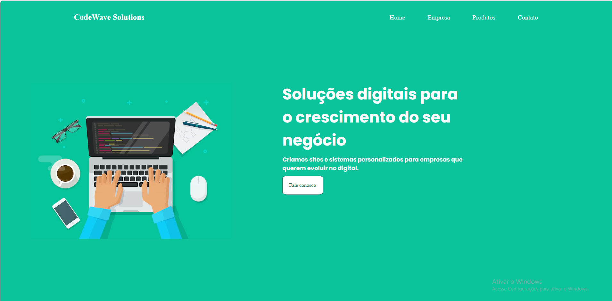
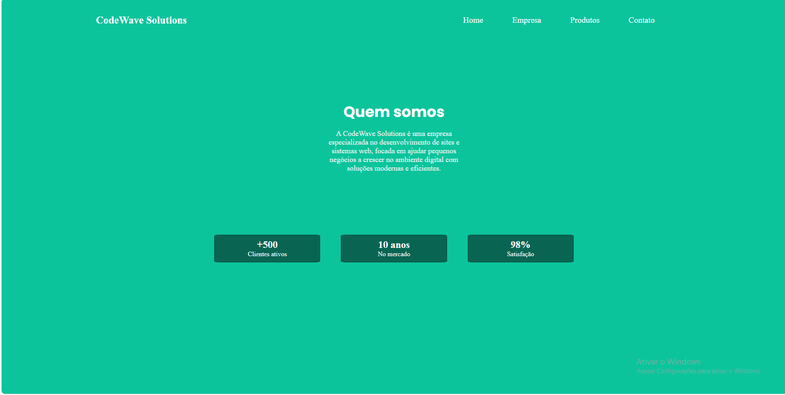
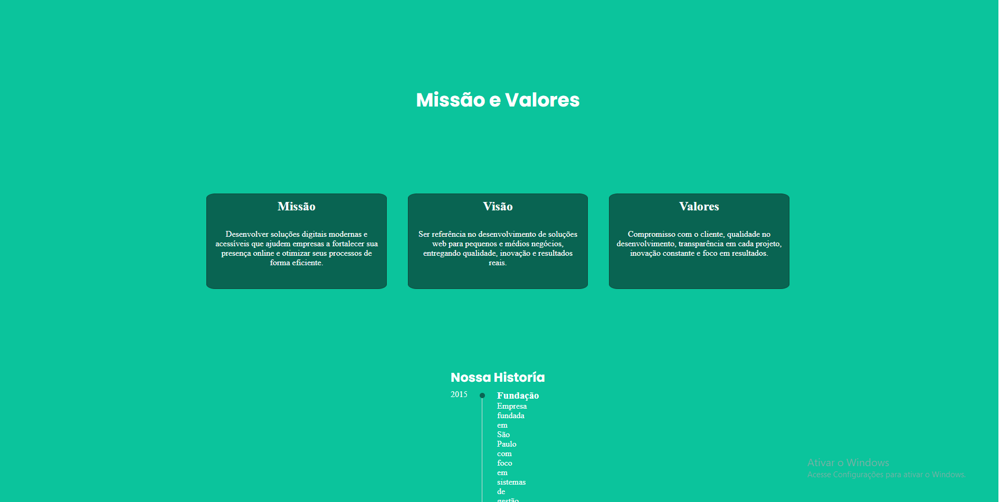
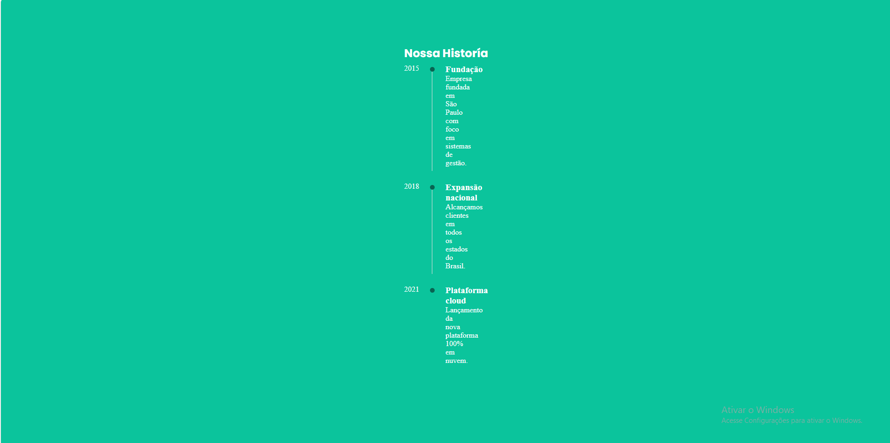
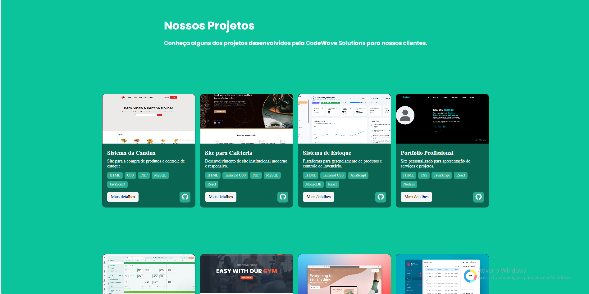
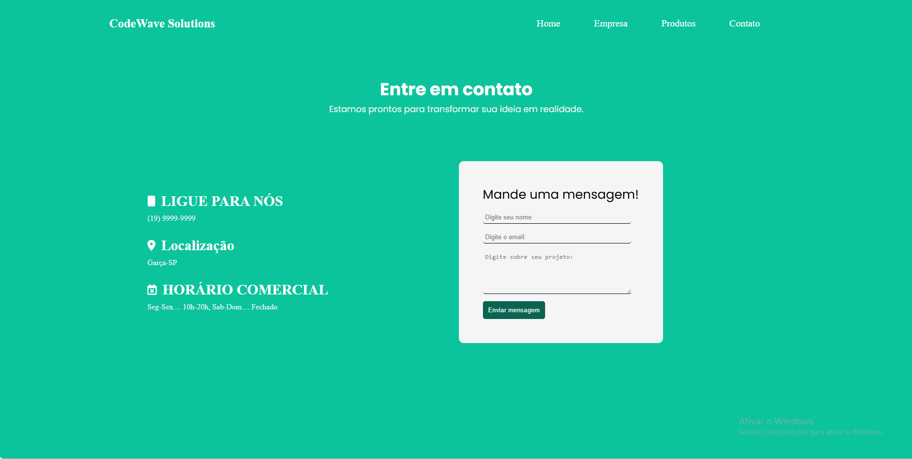
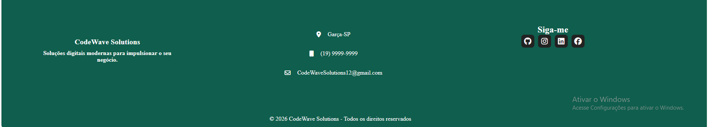

# site-institucional-codewave
Projeto de um site institucional responsivo desenvolvido como teste prático.

Tecnologias utilizadas:
- HTML5
- CSS3
- JavaScript

Funcionalidades:
- Layout parcialmente responsivo(Mobile)
- Menu mobile(Hamburgúer)
- Seções: Home, Empresa, Produtos e Contato
- Formulário de contato(Funcional)

Objetivo:
Desenvolver um site institucional completo, aplicando conceitos de responsividade e organização de código.

Previem:
### Home

### Empresa

### Produto

### Contato

### Footer

Prototipo canva:
https://canva.link/cjm9dsldyg0pgcv

Como executar
Abra o arquivo index.html em seu navegador.

Autor:
Raphael Toffoli da Silva Nobrega
